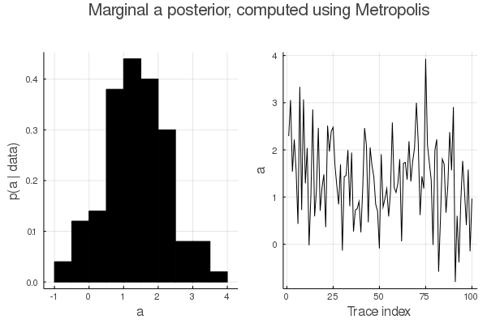
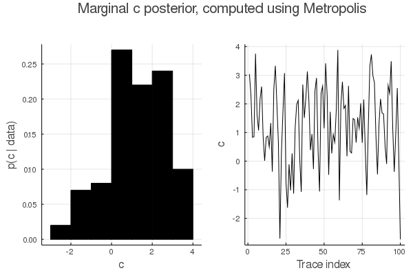

# CrimsonSkyline.jl

## trace
To a large extent, `Node`s have local control over the behavior of inference algorithms via their 
`interpretation`. There are a variety of `Interpretation`s. The type hierarchy is flat:
```
abstract type Interpretation end
struct Nonstandard <: Interpretation end
struct Standard <: Interpretation end
struct Replayed <: Interpretation end
struct Conditioned <: Interpretation end 
struct Blocked <: Interpretation end
struct Deterministic <: Interpretation end
struct Proposed <: Interpretation end
```
```@autodocs
Modules = [CrimsonSkyline]
Pages = ["trace.jl"]
```

## field
`CrimsonSkyline` also includes methods for sampling from undirected models.

### Using Metropolis-Hastings
Here is an example (taken directly from the tests!).
Suppose we have three variables ``a``, ``b``, and ``c``, 
with field structure `a - b - c` 
and continuous factors 
``\psi_{a,b}(a, b) = \mathrm{MvNormal}(0, \Sigma_{a,b})`` with
``\Sigma_{a,b} = \begin{pmatrix} 1.0 & 0.5 \\ 0.5 & 1.0 \end{pmatrix}``
and ``\psi_{b,c}(b, c) = \mathrm{MvNormal}(\begin{pmatrix} 2.0 & 2.0 \end{pmatrix}, \Sigma_{b,c})`` with 
``\Sigma_{b,c} = \begin{pmatrix} 2.0 & -1.0 \\ -1.0 & 2.0 \end{pmatrix}``.
We can construct the factors using two ordinary functions:
```
factor_ab(x) = logpdf(MvNormal(PDMat([1.0 0.5; 0.5 1.0])), x)
factor_bc(x) = logpdf(MvNormal([2.0, 2.0], PDMat([2.0 -1.0; -1.0 2.0])), x)
```
Suppose that we observe the data `b = 3.0`. 
We can instantiate the `RandomField` object with the factors and this evidence as
follows:
```
factors = Dict(["a", "b"] => factor_ab, ["b", "c"] => factor_bc)
evidence = Dict("b" => 3.0)
field = RandomField(factors, evidence)
```
In general one cannot sample from random fields directly and instead must use a method 
such as belief propagation or approximate inference methods. 
Here we use Metropolis Hastings.
We define a proposal kernel that can (a) propose new values and (b) score those values
in comparison with old sampled values. 
This functionality can be implemented as a function, but we will implement a struct
to capture some proposal kernel state (namely, the standard deviation of a 
proposal distribution). 
We define the proposal kernel as follows:
```
struct FactorProposal
    addresses :: Vector{String}
    last :: Vector{String}
    std :: Float64
end
FactorProposal(addresses) = FactorProposal(addresses, [addresses[1]], 0.5)
function (fp::FactorProposal)(x::Dict)
    new = deepcopy(x)
    address = rand(fp.addresses)
    new[address] = randn() * fp.std + new[address]
    fp.last[1] = address
    new
end
function (fp::FactorProposal)(x_prime::Dict, x::Dict)
    address = fp.last[1]
    logpdf(Normal(x[address], fp.std), x_prime[address]) - log(length(fp.addresses))
end
```
This is pretty straighforward: calling `fp(x)` generates a proposal `x_prime` i.e., ``x' \sim q(x)``
(which in this case is just a random walk step away from the 
current point) and calling `fp(x_prime, x)` computes the transition 
probability ``q(x' | x)``. 
Once we have the proposal in hand, we can sample from the posterior 
``p(a, c | b = 3.0)`` by calling `mh(...)` just as in the case of trace-based models:
```
addresses = ["a", "c"]
proposal = FactorProposal(addresses)
initial_values = Dict("a" => 0.0, "b" => 3.0, "c" => 0.0)
samples = mh(field, [proposal], initial_values; burn=1000, thin=100, num_iterations=11000)
```
Because `RandomField`s aren't generative models, we have to seed the MH algorithm with an 
initial value for each address. (In this case, the value used to seed `"b"` isn't used 
by `mh` because we've posted evidence to that address; if we just wanted to sample from 
``p(a, b, c)`` without posting evidence, the initiaizer `"b" => 3.0` would be used.)
We can visualize the marginal posteriors ``p(a|b=3.0)`` and ``p(c | b = 3.0)`` below (using
the built-in `plot_marginal`):



In combination with a proposal kernel and MH initialization point, random fields
can be used in `CrimsonSkyline`'s trace-based PPL. There is convenience wrapper 
to bundle these components together called `GenerativeField`. Here is an example
of using it in the trace-based PPL:
```
t = trace()
upstream_value = sample(t, "a", Normal())
# to pass upstream values as parameters to the random field
# just post them as evidence
field = RandomField(factors, Dict("a" => upstream_value))
proposal = FactorProposal(["b", "c"])
init = Dict("a" => 0.0, "b" => 0.0, "c" => 0.0)
gf = GenerativeField(field, proposal, init)
sample(t, "field", gf)
```

```@autodocs
Modules = [CrimsonSkyline]
Pages = ["field.jl"]
```

## io

Saving and loading traces and `SamplingResults` is possible using the `save` and `load` functions. This functionality depends on `JuliaDB`. 

Examples: 
```
# simple example model
function io_model(t::Trace, dim::Int64, data::Int64)
    z = sample(t, "z", Dirichlet(ones(dim)))
    observe(t, "x", Categorical(z), data)
end

# saving a trace
t = trace()
dim = 10
data = 7
io_model(t, dim, data)
testpath = joinpath(@__DIR__, "TESTIO")
db_file = joinpath(testpath, "test.jdb")
save(t, db_file)

# loading a trace
loaded_trace = load(db_file)

# creating and saving some results
results = mh(io_model; params = (dim, data), burn = 0, thin = 1, num_iterations=10)
results_file = joinpath(testpath, "io_model.csm")
save(results, results_file)

# loading saved results and use to serve model
loaded_results = load(joinpath(testpath, "io_model.csm"))
updated_model = update(io_model, loaded_results)  # update effect, see effects.jl
new_t, _ = updated_model(trace(), dim, data)
```

```@autodocs
Modules = [CrimsonSkyline]
Pages = ["io.jl"]
```

## effects
A library of functions that change the interpretation of some or all nodes in a trace.
```@autodocs
Modules = [CrimsonSkyline]
Pages = ["effects.jl"]
```

## basic sampling methods
Simple samplers such as forward and rejection sampling can be done "by hand", but
convenience methods are implemented to facilitate postprocessing of results.
```@autodocs
Modules = [CrimsonSkyline]
Pages = ["forward.jl","rejection.jl"]
```

## importance
Importance sampling algorithms and utilities. 
Currently the following importance sampling algorithms are implemented:

+ Likelihood weighting
+ Generic user-defined proposal

```@autodocs
Modules = [CrimsonSkyline]
Pages = ["importance.jl"]
```

## metropolis
Metropolis algorithm and utilities. Currently the following algorithms are implemented for both 
FOPPL and HOPPL programs:

+ Independent prior proposal
+ Arbitrary single- or multi-site proposal

Here are two examples of inference using the arbitrary MH step interface. Consider the following generative
function:
```
function normal_model(t :: Trace, data :: Vector{Float64})
    loc = sample(t, :loc, Normal(0.0, 10.0))
    scale = sample(t, :scale, LogNormal())
    for i in 1:length(data)
        observe(t, (:obs, i), Normal(loc, scale), data[i])
    end
end
```
To learn an approximate posterior for `:loc` and `:scale`, we will introduce two proposal kernels:
```
loc_proposal(old_t :: Trace, new_t :: Trace, data) = propose(new_t, :loc, Normal(old_t[:loc].value, 0.25))
scale_proposal(old_t :: Trace, new_t :: Trace, data) = propose(new_t, :scale, truncated(Normal(old_t[:scale].value, 0.25), 0.0, Inf))
```
Note that while `loc_proposal` is symmetric, `scale_proposal` is not. To perform inference, we pass these kernels to `mh_step` in 
a loop after first drawing a random trace:
```
t = trace()
normal_model(t, data)
for i in 1:niter
    t = mh_step(t, normal_model, loc_proposal; params = (data,))
    t = mh_step(t, normal_model, scale_proposal; params = (data,))
end
```
In this case, inference was fairly successful:
```
[ Info: True loc = 4.0
[ Info: True std = 1.0
[ Info: inferred E[loc] = 4.022688081613082
[ Info: inferred E[scale] = 0.9696559373495869
[ Info: approximate p(x) = sum_z p(x|z) = -138.63530736205144
```
As a less trivial (but still contrived!) inference example, we can infer the posterior distribution of a latent discrete random variable
in an open-universe model: 
```
function random_sum_model(t :: Trace, data)
    n = sample(t, :n, Geometric(0.1))
    loc = 0.0
    for i in 1:(n + 1)
        loc += sample(t, (:loc, i), Normal())
    end
    obs = Array{Float64, 1}()
    for j in 1:length(data)
        o = observe(t, (:data, j), Normal(loc, 1.0), data[j])
        push!(obs, o)
    end
    obs
end
```
(N.B.: we write the model is this form for pedagogic reasons; there is a far more efficient way to express the latent structure 
of this model, namely ``n \sim \text{Geometric}(0.1)``, ``\text{loc} \sim \text{Normal}(0, n)``.)
We are interested in learning the posterior distribution of `:n`. We introduce two proposal distributions, one for the latent discrete rv
and another generic proposal for the location increments:
```
function random_n_proposal(old_trace, new_trace, params...)
    old_n = float(old_trace[:n].value)
    if old_n > 0
        propose(new_trace, :n, Poisson(old_n))
    else
        propose(new_trace, :n, Poisson(1.0))
    end
end

gen_loc_proposal(old_trace, new_trace, ix, params...) = propose(new_trace, (:loc, ix), Normal(old_trace[(:loc, ix)].value, 0.25))
```
We again conduct inference by simply applying proposals within a loop. This time, the number of location increment proposals we need to 
construct is dependent on the sampled values of the latent random variable. We can either create these proposals on the fly as they're 
needed or create what is nearly guaranteed to be enough of them before any inference is performed, e.g., 
`loc_proposals = [(o, n, params...) -> gen_loc_proposal(o, n, i, params...) for i in 1:100]`.
Now that we have what we need, we can conduct inference:
```
t = trace()
random_sum_model(t, data)
...
for i in 1:niter
    t = mh_step(t, random_sum_model, random_n_proposal; params=(data,))
    for j in 1:(t[:n].value + 1)
        t = mh_step(t, random_sum_model, loc_proposals[j]; params=(data,))
    end
    push!(ns, t[:n].value)
end
```
Our inference results look promising:
```
[ Info: True :n = 9
[ Info: Posterior E[:n] = 7.581604598850287
```
For more examples, check back soon.

```@autodocs
Modules = [CrimsonSkyline]
Pages = ["metropolis.jl"]
```

## nested
```@autodocs
Modules = [CrimsonSkyline]
Pages = ["nested.jl"]
```

## results
```@autodocs
Modules = [CrimsonSkyline]
Pages = ["results.jl"]
```

## statistics
```@autodocs
Modules = [CrimsonSkyline]
Pages = ["statistics.jl"]
```

## Index
```@index
```
